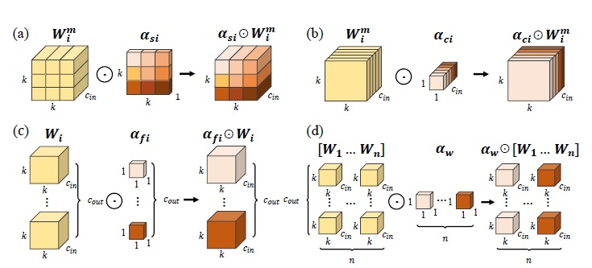

# **ECG R-Peak Detection**

This is the pipeline for training a 1D Omni-Dimentional Convolutional Neural Network to detect R-Peaks from ECG signal.

## ODConv

ODConv introduces a multi-dimensional attention mechanism with a parallel strategy to learn diverse attentions for convolutional kernels along all four dimensions of the kernel space.

    
    <h3 align="center">Omni-Dimentional Duynamic Convolution</h3>

Illustration of multiplying four types of attentions in ODConv to convolutional kernels
progressively. (a) Location-wise multiplication operations along the spatial dimension, (b) channelwise
multiplication operations along the input channel dimension, (c) filter-wise multiplication operations
along the output channel dimension, and (d) kernel-wise multiplication operations along the
kernel dimension of the convolutional kernel space.

